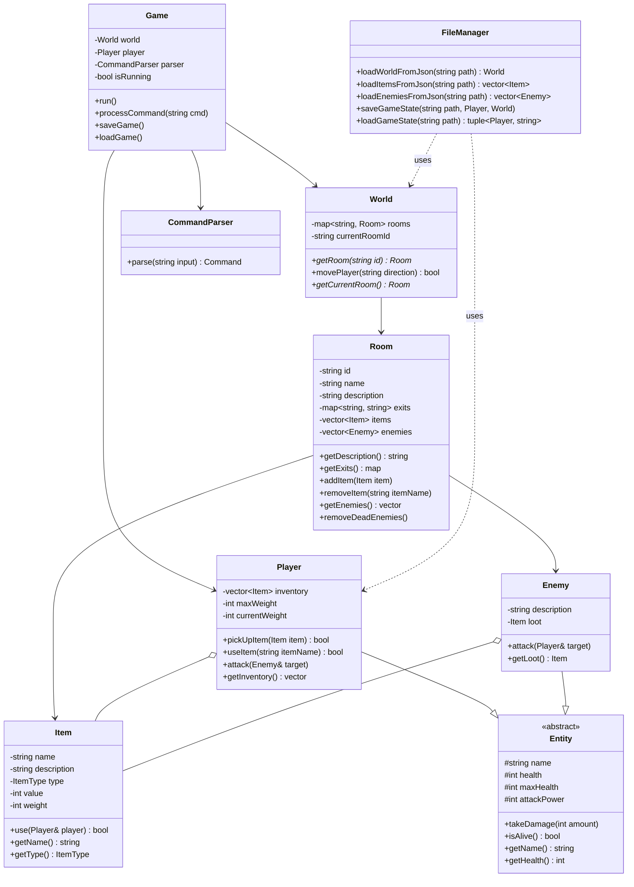
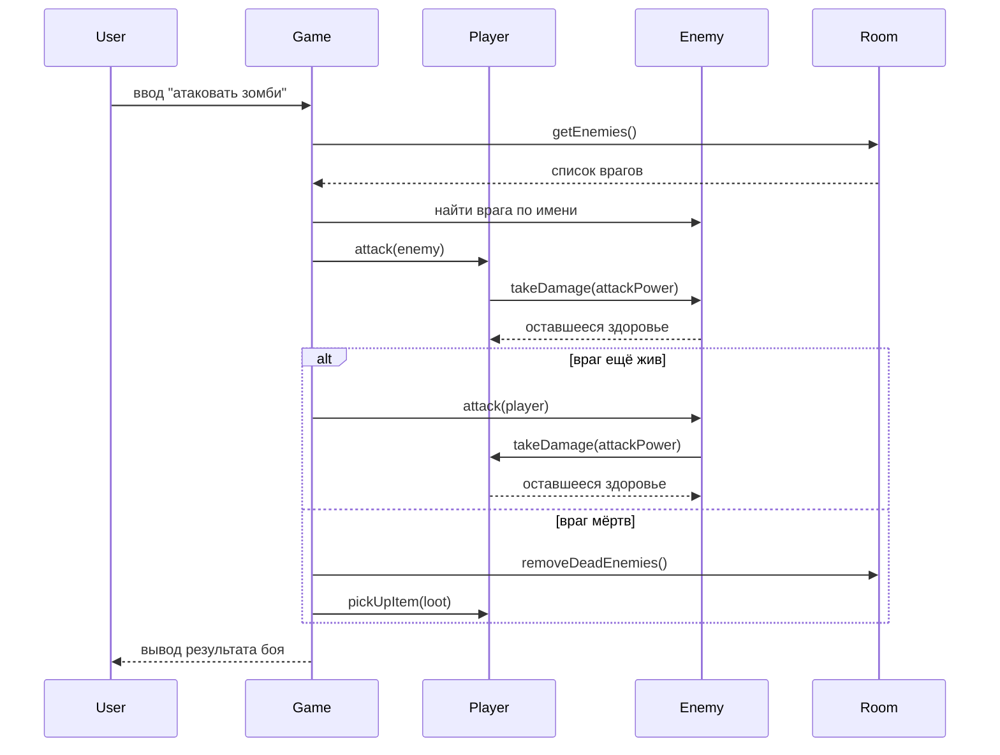
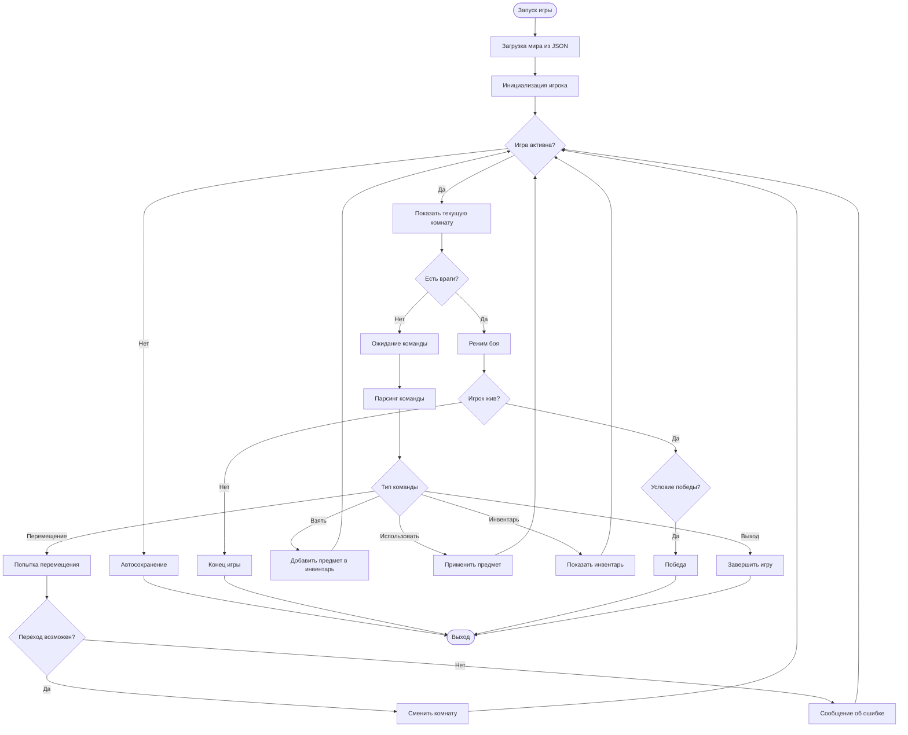

# Архитектурный проект Project "Wesker"

## 1. Общая архитектура

Игра построена по модульному принципу с чётким разделением ответственности:

- **Game** — управляет жизненным циклом игры, основным циклом, обработкой команд.
- **World** — хранит граф локаций (комнат) и обеспечивает навигацию.
- **Room** — описывает отдельную локацию: название, описание, выходы, предметы, врагов.
- **Entity** — абстрактный базовый класс для всех живых существ (игрок, враги).
  - **Player** — персонаж игрока, инвентарь, взаимодействие с миром.
  - **Enemy** — противник, поведение в бою, лут.
- **Item** — предмет, который можно подобрать/использовать.
- **CommandParser** — преобразует ввод пользователя в команды.
- **FileManager** — загрузка/сохранение данных из внешних файлов (JSON).

Взаимодействие между компонентами показано на диаграмме классов.

---

## 2. Диаграмма классов (Class Diagram)



---

## 3. Диаграмма последовательности боя (Sequence Diagram)



---

## 4. Диаграмма активности игрового цикла (Activity Diagram)



---

## 5. Состояние мира (World State)

Мир представляет собой направленный граф, где вершины — комнаты, рёбра — переходы по сторонам света. Состояние мира включает:

- Идентификатор текущей комнаты игрока.
- Для каждой комнаты:
  - Список оставшихся предметов (после того, как игрок что-то забрал).
  - Список живых врагов (после боёв враги удаляются из комнаты).
- Глобальные флаги (например, «найден ключ-карта», «босс побеждён») — реализуются через наличие определённых предметов в инвентаре или через отдельную систему переменных.

Сериализация состояния выполняется в JSON-файл при сохранении, десериализация — при загрузке.

---

## 6. Алгоритмы ключевых механик

### 6.1. Парсинг команд

Используется словарь синонимов. Входная строка разбивается на слова. Первое слово сопоставляется с глаголом (move, take, use, attack, look, inventory, quit). Остальные слова — аргументы (направление, имя предмета/врага).

```cpp
struct Command {
    enum Type { MOVE, TAKE, USE, ATTACK, LOOK, INVENTORY, QUIT, UNKNOWN };
    Type type;
    std::vector<std::string> args;
};

Command CommandParser::parse(const std::string& input) {
    // разбить строку, привести к нижнему регистру
    // сопоставить первое слово с глаголом
    // вернуть структуру Command
}
```

### 6.2. Боевая система

Пошаговый бой. Игрок атакует первым (если не указано иное). Расчёт урона:

```
damage = max(1, attacker.attackPower)
```

Здоровье цели уменьшается на `damage`. Если здоровье ≤ 0, цель погибает. Если после атаки игрока враг жив, он атакует в ответ.

Во время боя игрок может использовать предметы (например, аптечку) вместо атаки.

### 6.3. Инвентарь и ограничение по весу

Каждый предмет имеет вес. При попытке подобрать предмет проверяется, не превысит ли суммарный вес инвентаря `maxWeight`. Если превышает — игрок получает сообщение и предмет остаётся в комнате.

Использование расходуемого предмета удаляет его из инвентаря и применяет эффект (например, `health += 30`).

### 6.4. Сохранение и загрузка

Формат файла сохранения (JSON):

```json
{
  "player": {
    "name": "Оперативник",
    "health": 80,
    "maxHealth": 100,
    "attackPower": 15,
    "inventory": [
      { "name": "Аптечка", "type": "consumable", "value": 30, "weight": 1 },
      { "name": "Ключ-карта", "type": "key", "weight": 0 }
    ],
    "currentWeight": 1,
    "maxWeight": 20
  },
  "world": {
    "currentRoomId": "lab_entrance",
    "rooms": {
      "lab_entrance": {
        "items": [],
        "enemies": []
      },
      "main_hall": {
        "items": ["Записка"],
        "enemies": ["Зомби-охранник"]
      }
    }
  }
}
```

---
